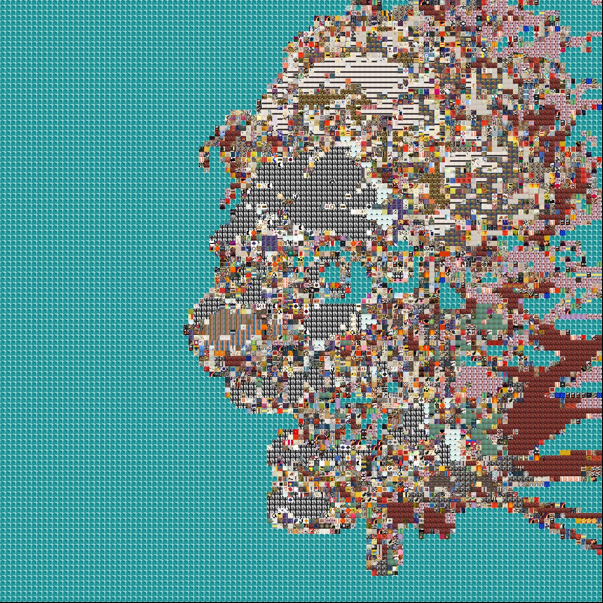

# Mosaic Creator 

The mosaic creator creates mosaics using other images from one master image. 
This project originally is for creating large pieces of art from a large art collection. 
This is one small project that is apart of one big project with lots of mini projects combined. 

### How It Works 

The program goes through and finds the median rgb value then the distance from white using  `CIELAB`,
it then creates a tree with all distances with different buckets/brackets for faster processing time.

The next part of the program looks at the master image and creates small 10x10 pixel tiles and finds the median rgb value
and then gets the `LAB` distance value. The program then goes through and trys to find the closest match to the sub image tree. 
After that, the program uses `histogram matching` allowing the sub image to take on the correct tint.

### Inputs/Outputs
**_Input_**

**_Output_**

### Issues Along The Way 

Originally I was using Euclidean Distance from white to compare the median rgb values, this lead to muddy images. I also had one
line of code, with rbg, instead of rgn. this led to off color images.

### Iterations Of The Program
**_Euclidean Distance_**

**_RBG Mix up_**

**_Corrected RGB_**

